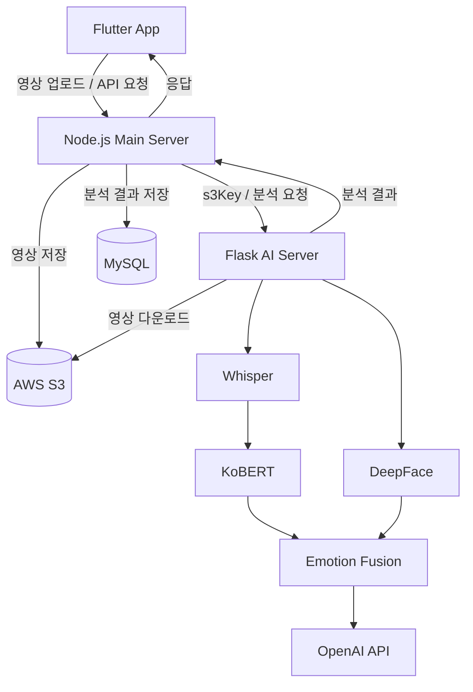

<div align="center">

<h1>마음.ZIP</h1>

<p><strong>표정과 목소리 속 감정을 기록하고, 하루의 마음을 돌아보는 감정 기록 앱.</strong></p>

<p>
영상의 표정과 발화 내용을 AI로 분석해 사용자의 감정을 추정하고,<br>
감정 기록과 피드백을 일별·주간 단위로 확인할 수 있는 모바일 애플리케이션입니다.
</p>

<p>
  <a href="#주요-기능">주요 기능</a>
  &nbsp;·&nbsp;
  <a href="#기술-스택">기술 스택</a>
  &nbsp;·&nbsp;
  <a href="#서비스-구조">서비스 구조</a>
  &nbsp;·&nbsp;
  <a href="#감정-분석-방식">감정 분석</a>
  &nbsp;·&nbsp;
  <a href="#로컬-실행">로컬 실행</a>
</p>

<br>

<p>
  
</p>

<p>
Flutter · Dart · Node.js · Flask · Python · MySQL · AWS
</p>

</div>

---

## 프로젝트 소개

감정을 직접 기록하는 방식은 사용자가 자신의 감정을 스스로 판단해야 하고, 기록을 지속하기 어렵다는 점에 주목했습니다.

마음.ZIP은 사용자가 촬영한 영상에서 **발화 내용과 표정 정보를 함께 분석**하여 감정 분포를 생성하고, 분석 결과와 GPT 기반 피드백을 제공합니다.

분석한 감정은 날짜별로 저장되며, 캘린더와 주간 리포트를 통해 자신의 감정 변화를 돌아볼 수 있도록 구성했습니다.

## 주요 기능

| 기능 | 설명 |
| --- | --- |
| **영상 감정 분석** | 촬영한 영상의 발화 내용과 표정을 분석하여 감정 분포 제공 |
| **멀티모달 분석** | 텍스트와 표정 분석 결과를 하나의 감정 분포로 결합 |
| **AI 피드백** | 분석된 감정과 발화 내용을 바탕으로 감정 피드백 생성 |
| **활동 추천** | 주요 감정에 맞는 활동 제안 |
| **감정 기록** | 분석 결과와 사용자의 메모를 날짜별로 저장 |
| **감정 캘린더** | 날짜별 대표 감정을 캘린더에서 확인 |
| **주간 리포트** | 기간별 감정 데이터를 집계하여 감정 변화와 피드백 제공 |
| **감정 대화** | 현재 감정을 기반으로 AI와 대화 |

### 사용 흐름

1. 사용자가 앱에서 영상을 촬영합니다.
2. 영상을 서버로 업로드하고 AI 분석을 요청합니다.
3. 발화 내용과 표정을 각각 분석합니다.
4. 두 분석 결과를 하나의 감정 분포로 결합합니다.
5. 분석 결과와 AI 피드백을 확인합니다.
6. 저장된 감정을 캘린더와 주간 리포트에서 다시 확인합니다.

## 기술 스택

| 영역 | 사용 기술 |
| --- | --- |
| 모바일 | Flutter, Dart |
| 메인 서버 | Node.js, Express |
| AI 서버 | Python, Flask |
| 데이터베이스 | MySQL |
| 음성 인식 | Whisper |
| 텍스트 감정 분석 | KoBERT |
| 표정 감정 분석 | DeepFace |
| 생성형 AI | OpenAI API |
| 파일 저장 | AWS S3 |
| 서버 환경 | AWS EC2 |
| 통신 | REST API, JSON, Multipart |

## 서비스 구조



| 구성 | 역할 |
| --- | --- |
| **Flutter** | 영상 촬영·업로드, 분석 결과 표시, 캘린더·리포트 UI |
| **Node.js** | 앱 API 처리, 파일 업로드, Flask 분석 요청, DB 저장 |
| **Flask** | Whisper·KoBERT·DeepFace 실행 및 감정 분석 |
| **MySQL** | 감정 분석 결과, 메모, 사용자 데이터 저장 |
| **AWS S3** | 분석 영상 저장 및 서버 간 영상 전달 |

Node.js가 애플리케이션 API와 데이터 저장을 담당하고, Flask는 AI 추론에 집중하도록 역할을 분리했습니다.

## 감정 분석 방식

### 1. 영상 분석

업로드된 영상에서 음성과 영상 프레임을 각각 처리합니다.

```text
영상
 ├─ 음성 → Whisper → 발화 텍스트 → KoBERT
 │
 └─ 영상 프레임 → DeepFace
                     ↓
              감정 결과 정규화
                     ↓
                Emotion Fusion
```

Whisper로 영상의 음성을 텍스트로 변환하고 KoBERT를 통해 발화 내용의 감정을 분석합니다.

영상에서는 일정 간격으로 프레임을 추출해 DeepFace로 표정 감정을 분석합니다.

### 2. 감정 데이터 정규화

텍스트 모델과 표정 모델에서 사용하는 감정 체계가 다르기 때문에 분석 결과를 다음 5개 감정으로 통일합니다.

| Key | 감정 |
| --- | --- |
| `joy` | 기쁨 |
| `sad` | 슬픔 |
| `anger` | 분노 |
| `neutral` | 평온 |
| `surprise` | 놀람 |

이를 통해 서로 다른 모델의 결과를 동일한 데이터 구조에서 처리할 수 있도록 했습니다.

### 3. 멀티모달 감정 결합

텍스트와 표정 분석 결과를 가중 결합하여 최종 감정 분포를 계산합니다.

```text
Final Emotion
= Text Emotion × 0.7
+ Face Emotion × 0.3
```

영상 표정 분석은 **0.5초 간격, 최대 180프레임**을 대상으로 처리하며, 프레임별 분석 결과를 종합합니다.

이를 통해 하나의 모델 결과만 사용하는 대신 발화 내용과 표정 정보를 함께 반영하도록 구성했습니다.

## 데이터 처리 흐름

```text
Flutter
   ↓
영상 업로드
   ↓
Node.js
   ↓
AWS S3
   ↓
Flask 분석 요청
   ↓
Whisper + KoBERT + DeepFace
   ↓
멀티모달 감정 결합
   ↓
Node.js
   ↓
MySQL 저장
   ↓
Flutter 결과 표시
```

분석 결과는 Node.js에서 다음과 같은 서비스 응답 형태로 정리하여 Flutter에 전달합니다.

```json
{
  "emotionData": {
    "joy": 0.13,
    "sad": 0.44,
    "anger": 0.17,
    "neutral": 0.09,
    "surprise": 0.17
  },
  "mainEmotion": "sad",
  "feedback": "분석된 감정을 바탕으로 생성된 피드백",
  "actions": []
}
```

## 문제 해결

### API 응답 구조 불일치

Flask에서는 분석이 정상적으로 완료됐지만 Flutter 결과 화면에서 모든 감정이 `0%`로 표시되는 문제가 발생했습니다.

HTTP 응답과 각 서버의 로그를 확인하여 AI 분석 자체가 아닌 **Node.js 응답 구조와 Flutter 데이터 참조 경로의 불일치**가 원인임을 확인했습니다.

Node.js에서 Flask 분석 결과를 서비스 응답으로 정리하고 Flutter에서 해당 응답을 화면 모델로 변환하도록 수정했습니다.

**결과:** 5개 감정 비율과 GPT 피드백이 결과 화면에 정상적으로 전달되도록 데이터 구조를 통일했습니다.

### 멀티모달 감정 데이터 통합

DeepFace와 텍스트 분석 모델의 감정 분류 체계가 달라 두 결과를 직접 결합하기 어려웠습니다.

각 모델의 출력을 공통 5개 감정으로 정규화하고, 텍스트와 표정 결과에 가중치를 적용해 하나의 감정 분포로 결합했습니다.

**결과:** 발화 내용과 표정 정보를 동일한 감정 기준으로 처리할 수 있는 분석 파이프라인을 구성했습니다.

### 날짜별 최신 감정 조회

하루에 여러 분석 결과가 저장될 경우 이전 분석 결과가 대표 감정으로 노출되는 문제가 있었습니다.

일별 조회는 `created_at` 기준 최신 결과를 선택하고, 기간 조회에서는 날짜별 최신 데이터를 대표값으로 사용하도록 조회 기준을 변경했습니다.

```sql
ORDER BY created_at DESC
LIMIT 1
```

**결과:** 캘린더와 감정 조회 화면에서 해당 날짜의 가장 최근 분석 결과가 일관되게 표시되도록 개선했습니다.

## 프로젝트 구성

```text
capstone2025-C3/
├── frontend/          # Flutter 애플리케이션
├── main-server/       # Node.js 메인 API 서버
└── analysis-server/   # Flask AI 분석 서버
```

| 경로 | 내용 |
| --- | --- |
| `frontend/` | Flutter UI 및 API 연동 |
| `main-server/` | API, DB, S3 및 Flask 연동 |
| `analysis-server/` | Whisper, KoBERT, DeepFace 기반 AI 분석 |
| `analysis-server/services/` | STT, 감정 분석, Fusion, GPT 관련 모듈 |

## 로컬 실행

### 1. Flask AI 서버

Python 가상환경을 생성하고 필요한 패키지를 설치합니다.

```powershell
cd analysis-server

python -m venv venv310
.\venv310\Scripts\Activate.ps1

pip install -r requirements.txt
python app.py
```

기본 포트:

```text
http://localhost:5001
```

### 2. Node.js 메인 서버

새 터미널에서 실행합니다.

```powershell
cd main-server
npm install
npm start
```

기본 포트:

```text
http://localhost:3000
```

### 3. Flutter

새 터미널에서 실행합니다.

```powershell
cd frontend
flutter pub get
flutter run
```

Android Emulator에서 로컬 서버에 접근할 경우 환경에 맞는 서버 주소를 설정해야 합니다.

```dart
const String kBaseUrl = 'http://10.0.2.2:3000';
```

## 환경 변수

API 키와 DB 접속 정보는 저장소에 직접 포함하지 않고 환경 변수로 관리합니다.

예시:

```env
OPENAI_API_KEY=
AWS_ACCESS_KEY_ID=
AWS_SECRET_ACCESS_KEY=
AWS_S3_BUCKET=

DB_HOST=
DB_USER=
DB_PASSWORD=
DB_NAME=
```

실제 키와 비밀번호는 Git에 커밋하지 않습니다.

---

<div align="center">

### 마음.ZIP

**감정을 분석하고, 기록하고, 다시 돌아볼 수 있도록.**

Flutter · Node.js · Flask · Whisper · KoBERT · DeepFace

</div>
