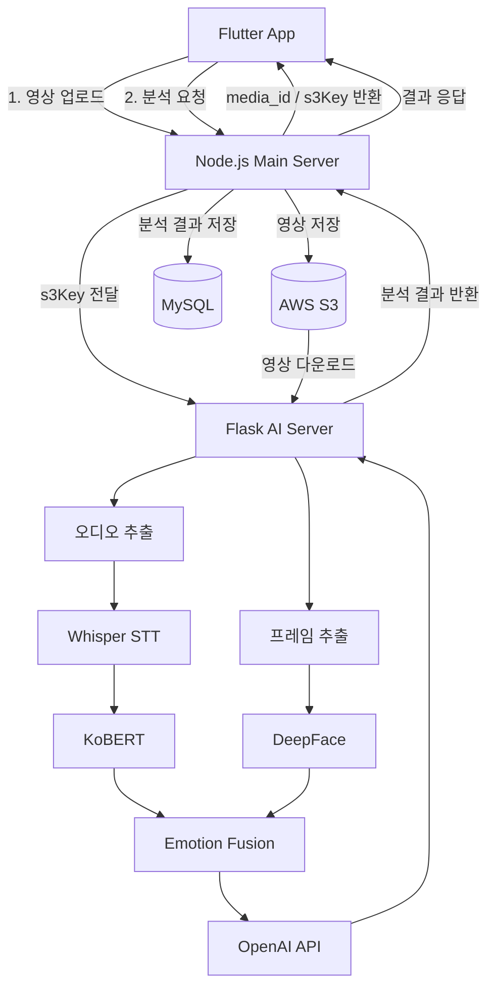
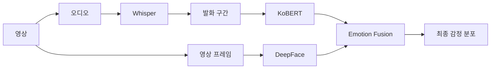

<div align="center">

# 마음.ZIP

<p><strong>표정과 목소리 속 감정을 기록하고 돌아보는 감정 분석 앱</strong></p>

<p>
사용자가 촬영한 영상의 발화 내용과 표정을 함께 분석하여<br>
감정 분포를 기록하고 피드백을 제공하는 모바일 애플리케이션입니다.
</p>

<p>
  <a href="#주요-기능">주요 기능</a>
  &nbsp;·&nbsp;
  <a href="#기술-스택">기술 스택</a>
  &nbsp;·&nbsp;
  <a href="#서비스-구조">서비스 구조</a>
  &nbsp;·&nbsp;
  <a href="#감정-분석-방식">감정 분석</a>
  &nbsp;·&nbsp;
  <a href="#로컬-실행">로컬 실행</a>
</p>

<br>

<p>
  
</p>

<p>
Flutter · Node.js · Flask · Python · MySQL · AWS S3
</p>

</div>

---

## 프로젝트 소개

마음.ZIP은 사용자가 촬영한 영상에서 **발화 내용과 표정을 함께 분석**하여 감정을 기록하고 돌아볼 수 있도록 만든 모바일 애플리케이션입니다.

영상의 음성은 **Whisper와 KoBERT**, 표정은 **DeepFace**를 이용해 분석합니다. 서로 다른 모델의 분석 결과를 공통 감정 체계로 정규화한 뒤 하나의 감정 분포로 결합합니다.

분석 결과와 메모는 날짜별로 관리하며, 캘린더와 주간 리포트를 통해 자신의 감정 흐름을 확인할 수 있도록 구성했습니다.

---

## 주요 기능

| 기능 | 설명 |
| --- | --- |
| **영상 감정 분석** | 촬영한 영상의 발화 내용과 표정을 분석 |
| **멀티모달 감정 분석** | 텍스트와 표정 분석 결과를 결합해 최종 감정 분포 계산 |
| **AI 피드백** | 분석된 감정과 발화 내용을 바탕으로 감정 피드백 생성 |
| **활동 추천** | 주요 감정에 따라 일상에서 실천할 수 있는 활동 제안 |
| **감정 기록** | 분석 결과와 사용자가 작성한 메모 저장 |
| **감정 캘린더** | 날짜별 대표 감정과 기록 확인 |
| **주간 리포트** | 기간별 감정 분포와 감정 흐름 확인 |
| **감정 대화** | 현재 감정을 바탕으로 AI와 대화 |

### 사용 흐름

1. 앱에서 영상을 촬영합니다.
2. 영상을 업로드하고 AI 분석을 요청합니다.
3. 발화 내용과 표정을 각각 분석합니다.
4. 두 분석 결과를 결합해 최종 감정 분포를 계산합니다.
5. 감정 결과와 AI 피드백을 확인합니다.
6. 결과를 날짜별로 기록하고 캘린더와 주간 리포트에서 확인합니다.

---

## 기술 스택

| 영역 | 사용 기술 |
| --- | --- |
| 모바일 | Flutter, Dart |
| 메인 서버 | Node.js, Express |
| AI 분석 서버 | Python, Flask |
| 데이터베이스 | MySQL |
| 파일 저장 | AWS S3 |
| STT | Whisper |
| 텍스트 감정 분석 | KoBERT |
| 표정 감정 분석 | DeepFace |
| 생성형 AI | OpenAI API |
| 서버 통신 | REST API, JSON, Multipart |

---

## 서비스 구조



### 서버별 역할

| 구성 | 역할 |
| --- | --- |
| **Flutter** | 영상 촬영·업로드, 분석 요청, 결과·캘린더·리포트 UI |
| **Node.js** | API 처리, 영상 업로드, S3 연동, 분석 요청 중계, MySQL 저장 |
| **Flask** | 영상 전처리, Whisper·KoBERT·DeepFace 실행, 감정 결합, AI 피드백 생성 |
| **AWS S3** | 업로드된 영상 파일 저장 |
| **MySQL** | 감정 분석 결과, 메모 등 서비스 데이터 저장 |

영상 **업로드와 AI 분석을 별도의 요청으로 분리**했습니다.

먼저 Node.js가 영상을 S3에 저장하고 `media_id`와 `s3Key`를 반환합니다. 이후 분석 요청에서 해당 `s3Key`를 Flask에 전달하고, Flask가 S3에서 영상을 내려받아 AI 분석을 수행합니다.

---

## 감정 분석 방식

영상 하나에서 **발화 내용과 표정이라는 두 종류의 정보**를 추출하여 각각 분석합니다.



### 1. 음성 → 텍스트

영상에서 오디오를 추출하고 Whisper를 이용해 음성을 텍스트와 발화 구간으로 변환합니다.

```text
Video
  ↓
Audio
  ↓
Whisper
  ↓
Transcript / Segments
```

### 2. 텍스트 감정 분석

Whisper가 생성한 발화 구간을 KoBERT로 분석합니다.

전체 문장을 한 번만 분류하는 대신 **발화 구간별 감정을 분석하고 구간 길이를 반영하여 전체 텍스트 감정 분포를 계산**합니다.

```text
Whisper Segments
       ↓
  KoBERT 분석
       ↓
구간별 감정 분포
       ↓
   가중 평균
       ↓
Text Emotion
```

### 3. 표정 감정 분석

DeepFace를 이용해 영상 프레임에서 표정 감정을 분석합니다.

모든 영상 프레임을 처리하지 않고 **0.5초 간격으로 최대 180프레임**을 분석하도록 제한했습니다.

각 프레임은 동일하게 반영하지 않고 **얼굴 영역 크기와 프레임 선명도**를 이용해 가중치를 적용합니다.

이를 통해 얼굴이 작거나 흐릿하게 촬영된 프레임이 최종 결과에 미치는 영향을 줄이도록 구성했습니다.

### 4. 감정 체계 정규화

KoBERT와 DeepFace는 서로 다른 감정 분류 체계를 사용하기 때문에 분석 결과를 바로 결합할 수 없습니다.

두 모델의 출력을 다음 5개 감정으로 변환하여 사용합니다.

```text
joy · sad · anger · neutral · surprise
```

예를 들어 일부 감정은 공통 감정 체계에 맞게 다음처럼 변환합니다.

| 모델 감정 | 공통 감정 |
| --- | --- |
| happy | joy |
| fear | sad |
| disgust | anger |

변환된 분포는 다시 정규화하여 모델별 출력 형식의 차이를 줄입니다.

### 5. 멀티모달 감정 결합

텍스트와 표정 분석 결과를 하나의 최종 감정 분포로 결합합니다.

```text
Final Emotion
= Text Emotion × 0.7
+ Face Emotion × 0.3
```

| 분석 정보 | 가중치 |
| --- | ---: |
| 텍스트 감정 | 70% |
| 표정 감정 | 30% |

발화 내용을 주요 감정 정보로 사용하면서 표정 정보를 함께 반영하도록 구성했습니다.

분석 신뢰도가 낮거나 두 분석 결과가 크게 충돌하는 경우를 판단하기 위한 처리 로직도 포함했습니다.

---

## AI 피드백

멀티모달 분석으로 생성한 감정 분포와 발화 내용을 바탕으로 사용자에게 감정 피드백을 제공합니다.

```text
감정 분포 + 발화 내용
        ↓
   OpenAI API
        ↓
   감정 피드백
```

분석 모델 자체의 감정 판단과 생성형 AI의 역할을 분리하여, **Whisper·KoBERT·DeepFace가 감정을 분석하고 OpenAI API는 분석 결과를 사용자에게 전달할 피드백 생성에 활용**했습니다.

---

## 감정 데이터 관리

분석 결과는 Node.js를 통해 MySQL에 저장합니다.

| 데이터 | 내용 |
| --- | --- |
| 감정 분포 | 기쁨·슬픔·분노·평온·놀람 |
| 대표 감정 | 분석 결과 중 주요 감정 |
| AI 피드백 | 감정 결과를 기반으로 생성된 피드백 |
| 활동 추천 | 감정에 따른 활동 |
| 메모 | 사용자가 직접 작성한 감정 기록 |
| 생성 시각 | 분석 결과 생성 시간 |

하루에 여러 분석 결과가 생성될 수 있기 때문에 날짜별 대표 결과를 조회할 때는 **`created_at`을 기준으로 가장 최근 분석 결과**를 사용하도록 구성했습니다.

이를 통해 결과 화면, 감정 캘린더, 리포트에서 사용할 데이터의 기준을 일관되게 유지합니다.

---

## 주요 구현 포인트

### 영상 분석량 제어

영상의 모든 프레임을 분석할 경우 영상 길이에 따라 처리량이 크게 증가합니다.

표정 분석 대상을 **0.5초 간격·최대 180프레임**으로 제한하여 입력 영상에 따른 분석량을 제어했습니다.

### 프레임 품질 반영

표정 분석 시 얼굴이 작거나 흐린 프레임까지 동일하게 평균하면 결과가 불안정해질 수 있습니다.

얼굴 영역의 크기와 프레임 선명도를 기반으로 가중치를 적용하여 상대적으로 품질이 높은 프레임이 결과에 더 많이 반영되도록 구성했습니다.

### 모델별 감정 체계 통합

KoBERT와 DeepFace의 감정 라벨 체계가 달라 두 결과를 직접 결합할 수 없었습니다.

각 모델의 결과를 공통 5개 감정으로 매핑하고 정규화한 뒤 텍스트와 표정 결과를 하나의 감정 분포로 결합했습니다.

### API 응답 구조 정리

개발 과정에서 Flask의 분석은 정상적으로 완료됐지만 Flutter에서는 모든 감정 비율이 0%로 표시되는 문제가 있었습니다.

서버별 응답을 확인해 데이터 참조 구조의 차이를 찾고, Node.js에서 분석 결과를 서비스 응답 형태로 정리한 뒤 Flutter에서 화면 모델로 변환하도록 수정했습니다.

---

## 프로젝트 구성

```text
capstone2025-C3/
│
├── frontend/              # Flutter 애플리케이션
│
├── main-server/           # Node.js 메인 서버
│
└── analysis-server/       # Flask AI 분석 서버
    ├── app.py
    └── services/
        ├── stt.py         # Whisper STT
        ├── kobert.py      # 텍스트 감정 분석
        ├── vision.py      # DeepFace 표정 분석
        ├── fusion.py      # 멀티모달 감정 결합
        └── gpt.py         # AI 피드백
```

| 경로 | 내용 |
| --- | --- |
| `frontend/` | Flutter 화면 및 서버 API 연동 |
| `main-server/` | Node.js API, S3·MySQL 연동 |
| `analysis-server/` | Flask 기반 AI 분석 서버 |
| `analysis-server/services/stt.py` | Whisper 음성 인식 |
| `analysis-server/services/kobert.py` | 텍스트 감정 분석 |
| `analysis-server/services/vision.py` | 영상 표정 분석 |
| `analysis-server/services/fusion.py` | 텍스트·표정 결과 결합 |

---

## 로컬 실행

### 1. Flask AI 서버

Python 가상환경을 생성하고 필요한 패키지를 설치합니다.

```bash
cd analysis-server
python -m venv venv
```

Windows:

```powershell
.\venv\Scripts\activate
pip install -r requirements.txt
python app.py
```

기본 포트:

```text
5001
```

### 2. Node.js 메인 서버

```bash
cd main-server
npm install
npm start
```

기본 포트:

```text
3000
```

MySQL, AWS S3, Flask 서버 주소 등 필요한 환경변수를 설정해야 합니다.

### 3. Flutter

```bash
cd frontend
flutter pub get
flutter run
```

Android Emulator에서 로컬 서버에 접근하는 경우 서버 주소 설정을 확인해야 합니다.

```text
10.0.2.2
```

실기기에서는 개발 PC의 네트워크 주소를 사용합니다.

---

## 프로젝트 정보

| 항목 | 내용 |
| --- | --- |
| 개발 기간 | 2025.05 ~ 2025.11 |
| 형태 | 팀 프로젝트 |
| 플랫폼 | Android / Flutter |
| 주요 분야 | 모바일 · 백엔드 · AI 분석 |

---

<div align="center">

### 마음.ZIP

**감정을 분석하고, 기록하고, 다시 돌아볼 수 있도록.**

Flutter · Node.js · Flask · Whisper · KoBERT · DeepFace

</div>
